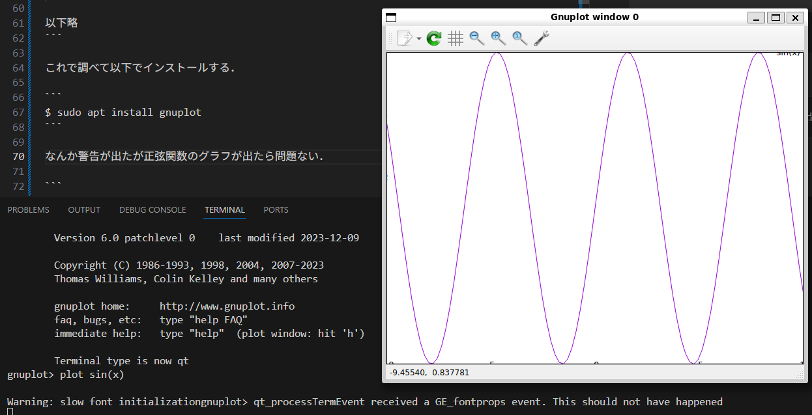
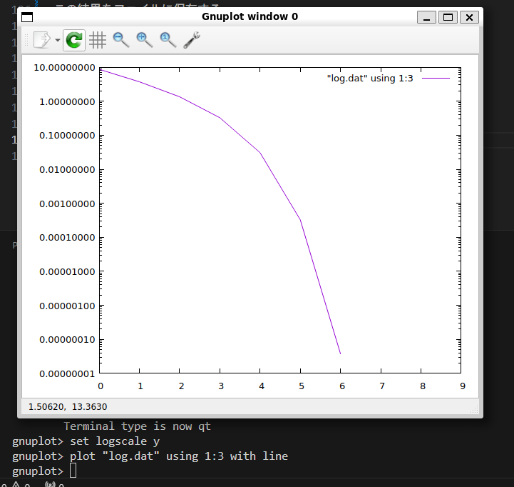

# 数値計算の始め方

数値計算の経験はあるけれど長い間離れていた人に向けて．


OSはWindows11を想定する．

## 環境を構築する

昔はWindows環境だと面倒な時代があったが今はWSLがあるので楽な時代になった．

### WSLを導入する

Windows11にWSLをインストールする．

方法は [WSL を使用して Windows に Linux をインストールする方法](https://learn.microsoft.com/ja-jp/windows/wsl/install) を見ながら行う．これだけでは分かりにくいのでGoogle検索で「WSL インストール」として調べるなどすれば参考になる記事があると思う．

Linuxの種類（Distribution）はUbuntuの最新版とかを入れておけばよい．現在の筆者の環境は"Ubuntu 24.04.2 LTS"をインストールしている．好きなものを入れればよい．

そうすればスタートメニューからUbuntuが起動できるようになる．黒い画面（端末，ターミナル）が出てくれば問題ない．


次にVisual Studio Codeをインストールする．

### VSCodeのインストール

[Windows Subsystem for Linux での Visual Studio Code の使用を開始する
2025/06/11](https://learn.microsoft.com/ja-jp/windows/wsl/tutorials/wsl-vscode)

この記事を参考にすればよい．またはググるなど．

端末上で以下を入力して画面が出てくれば成功．（カレントディレクトリをVSCodeで開くの意）

```
$ code .
```

VSCode拡張は好きなものを入れればよい．

例えば以下の画像の通り．


### gnuplotのインストール

正直可視化できるなら何でもいい．

[gnuplot homepage](http://www.gnuplot.info/)

これをインストールする．面倒なのでaptで入れてしまう．Ubuntuのパッケージマネージャーみたいなやつ．`Python` なら `Matplotlib` を使えると便利かもしれない．Excelでも問題ない．

```
$ sudo apt search gnuplot
[sudo] password for itmz153: 
Sorting... Done
Full Text Search... Done

中略

gnuplot/noble,now 6.0.0+dfsg1-1ubuntu3 all [installed]
  Command-line driven interactive plotting program.

以下略
```

これで調べて以下でインストールする．

```
$ sudo apt install gnuplot
```

なんか警告が出たが正弦関数のグラフが出たら問題ない．

```
$ gnuplot

        G N U P L O T
        Version 6.0 patchlevel 0    last modified 2023-12-09 

        Copyright (C) 1986-1993, 1998, 2004, 2007-2023
        Thomas Williams, Colin Kelley and many others

        gnuplot home:     http://www.gnuplot.info
        faq, bugs, etc:   type "help FAQ"
        immediate help:   type "help"  (plot window: hit 'h')

        Terminal type is now qt
gnuplot> plot sin(x)

Warning: slow font initializationgnuplot> qt_processTermEvent received a GE_fontprops event. This should not have happened
```

画面はこのような感じ．



### 数値計算はじめの一歩

`lecture_001`に入れたプログラムをコンパイルして実行する．

```
$ g++ main.cpp
```

そうすると `a.out` が生成されている．

```
$ ls
a.out  main.cpp
```

実行する．

```
$ ./a.out 
0 10.050000000000001 8.635786437626905
1 5.124502487562189 3.710288925189094
2 2.757392138419574 1.343178576046479
3 1.741357580449592 0.327144018076497
4 1.444943381958916 0.030729819585821
5 1.414540330128693 0.000326767755598
6 1.414213600115803 0.000000037742708
7 1.414213562373096 0.000000000000000
8 1.414213562373095 0.000000000000000
9 1.414213562373095 0.000000000000000
```

この結果をファイルに保存する．

例えば以下のようにする．

```
$ ./a.out > log.dat
```

gnuplotで可視化してみる．



誤差を対数スケールで見ている．

```
gnuplot> set logscale y
gnuplot> plot "log.dat" using 1:3 with line
```

なんだかとても早く収束してそうっていうのがわかるかと思う．
